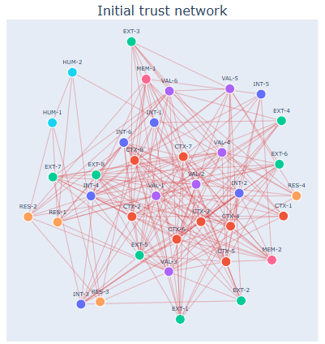
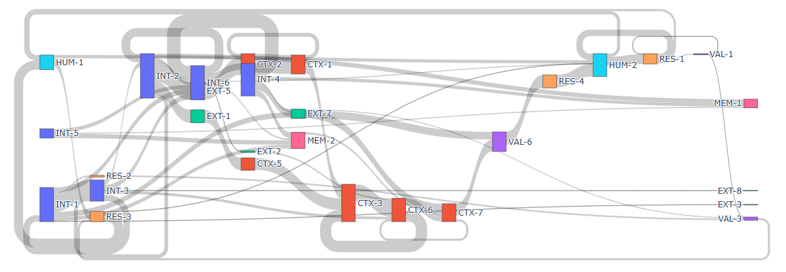
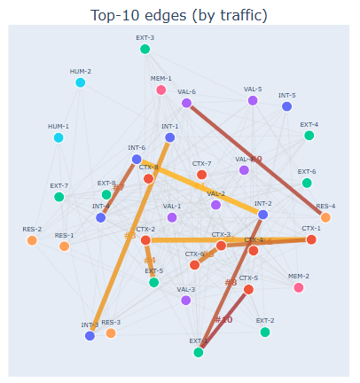
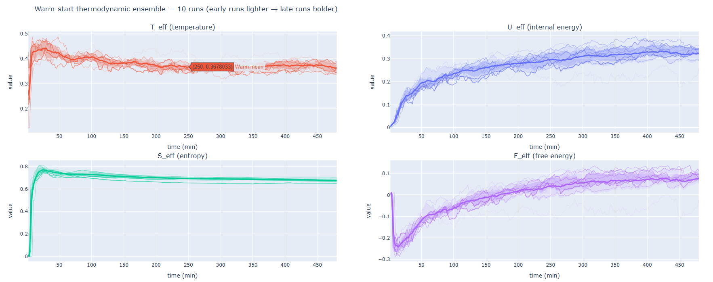
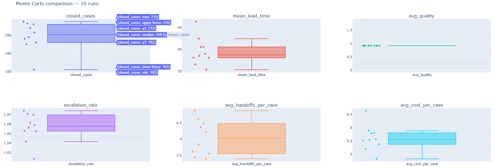
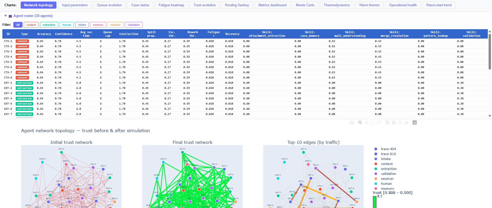

# Symulacja sieci agentów *(Multi-Agent Simulation)*

Symulacja służy do badania organizowania przetwarzania informacji przez sieć agentów w procesie biznesowym. Jako przykład wybrałem proces klasyfikacji wiadomości email i ekstrakcji danych z załączników na przestrzeni jednego dnia operacyjnego.



Celem projektu jest zrozumienie, kiedy lokalne decyzje agentów prowadzą do **globalnego porządku w procesie**, albo kiedy tworzą:

- centra (huby),
- przeciążenia,
- ukryte wąskie gardła (bottlenecks),
- nadmierną eskalację do człowieka,
- oraz lokalnie skuteczne, ale nieoptymalne globalnie ścieżki komunikacji.

*Na końcu dokumentu zamieszczony jest słownik pojęć.*

## Spis treści

- [Symulacja sieci agentów *(Multi-Agent Simulation)*](#symulacja-sieci-agentów-multi-agent-simulation)
  - [Spis treści](#spis-treści)
  - [Główna idea](#główna-idea)
  - [Jaki problem jest symulowany](#jaki-problem-jest-symulowany)
    - [Najważniejsze pytania badawcze:](#najważniejsze-pytania-badawcze)
  - [Co oznacza emergencja w tym projekcie](#co-oznacza-emergencja-w-tym-projekcie)
  - [Dlaczego pojawia się ANT](#dlaczego-pojawia-się-ant)
  - [Dlaczego pojawia się „termodynamika”](#dlaczego-pojawia-się-termodynamika)
  - [Dlaczego pojawia się tu Monte Carlo (MC)](#dlaczego-pojawia-się-tu-monte-carlo-mc)
    - [1. Ocena stabilności wyników](#1-ocena-stabilności-wyników)
    - [2. Porównanie scenariuszy](#2-porównanie-scenariuszy)
    - [3. Szersza perspektywa na „termodynamikę” systemu](#3-szersza-perspektywa-na-termodynamikę-systemu)
    - [Single run vs Monte Carlo](#single-run-vs-monte-carlo)
  - [Co nie jest celem projektu](#co-nie-jest-celem-projektu)
  - [Najważniejsze wyniki, których szukamy](#najważniejsze-wyniki-których-szukamy)
  - [Instalacja](#instalacja)
  - [Uruchomienie symulacji](#uruchomienie-symulacji)
    - [Pełna symulacja z wizualizacjami](#pełna-symulacja-z-wizualizacjami)
    - [Symulacja bez wizualizacji](#symulacja-bez-wizualizacji)
    - [Konfiguracja](#konfiguracja)
  - [Słownik skrótów](#słownik-skrótów)
  - [Literatura](#literatura)
    - [Multi-Agent Systems](#multi-agent-systems)
    - [Agent-Based Simulation / Process Simulation](#agent-based-simulation--process-simulation)
    - [ANT](#ant)
  - [Główna teza projektu](#główna-teza-projektu)

---

## Główna idea

Projekt traktuje system agentowy jako **sieć relacji**.

Zachodzące procesy w sieci są podzielone na trzy poziomy:

- **poziom lokalny** — kompetencje, koszt, czas, pewność (confidence), degradacja skuteczności (fatigue) pojedynczego agenta,
- **poziom relacyjny** — routing, trust, historyczny sukces, kolejki, przekazywanie zadań,
- **poziom makro** — KPI procesu, koncentracja ruchu, bottlenecks, emergencja, odporność.

Projekt zakłada, że:
- dobra lokalna decyzja nie zawsze daje dobry wynik globalnie,
- pamięć relacyjna (`warm start`) nie zawsze poprawia KPI,
- topologia relacji może być równie ważna jak jakość samego agenta.

---

## Jaki problem jest symulowany

Model reprezentuje uproszczony, lecz realistyczny biznesowy proces:

1. Wiadomość e-mail wpływa do systemu.
2. Wiadomość może zawierać załączniki, a dane mogą być niepełne lub niejednoznaczne.
3. Sieć agentów:
   - interpretuje kontekst,
   - klasyfikuje sprawę,
   - dzieli ją na podzadania,
   - ekstrahuje dane,
   - sprawdza wyniki,
   - scala odpowiedzi,
   - trudne przypadki eskaluje do człowieka.
4. W trakcie działania powstają lokalne wzorce współpracy, przeciążenia i dominujące ścieżki przepływu (routing).



### Najważniejsze pytania badawcze:

- Czy sieć agentów samoorganizuje się w sposób korzystny dla biznesu?
- Czy trust (lokalna pamięć) poprawia wynik procesu, czy tylko utrwala lokalne przyzwyczajenia?
- Czy `warm start` skutkuje lepszym porządkiem, czy też prowadzi do większej inercji systemu?
- Kiedy wysoka jakość końcowa wynika z autonomii agentów, a kiedy głównie z eskalacji do człowieka?
- Czy można wykrywać przeciążenie systemu wcześniej niż poprzez same KPI?

---

## Co oznacza emergencja w tym projekcie

Emergencja w niniejszej symulacji oznacza, że wzorce pracy sieci:

- nie są zapisane w jednej regule,
- nie są planowane centralnie,
- nie wynikają wyłącznie z „najlepszego agenta”,

ale powstają z wielu lokalnych interakcji.

Przykłady:
- kilku agentów przejmuje większość ruchu mimo symetrycznych parametrów,
- trust uczy się relacji, ale nie poprawia globalnych KPI,
- topologia i lokalne polityki tworzą trwałe wąskie gardła (bottlenecks),
- system utrzymuje jakość głównie dzięki człowiekowi.



---

## Dlaczego pojawia się ANT

Projekt jest inspirowany Actor-Network Theory (ANT), ale nie jest formalną implementacją tej teorii.

ANT jest tu używana jako **rama interpretacyjna** - sprawczość w systemie nie należy wyłącznie do agentów, lecz powstaje w relacjach między:

- agentami,
- zadaniami,
- wiadomościami i załącznikami,
- trustem,
- progami eskalacji,
- kolejkami,
- timeoutami,
- SLA,
- i człowiekiem jako warstwą interwencji.

Dzięki temu projekt można wykorzystać nie tylko jako symulację przepływu (workflow), ale również jako model **sieci socjo-technicznej**.

---

## Dlaczego pojawia się „termodynamika”

Projekt używa wskaźników inspirowanych fizyką statystyczną:

- `T_eff` — effective temperature (temperatura),
- `U_eff` — effective internal energy (energia wewnętrzna),
- `S_eff` — effective entropy (entropia),
- `F_eff` — effective free energy (energia swobodna).



Nie są to ścisłe wielkości fizycznem ale **operacyjne analogie** w celu monitoringu systemu:

- `T_eff` — temperatura odzwierciedla poziom fluktuacji i niepewności,
- `U_eff` — energia wewnętrzna to napięcie operacyjne związane z kolejkami, błędami i ryzykiem związanym z SLA,
- `S_eff` — entropia jako miara nieuporządkowania pozwala oceniać rozproszenie ruchu po ścieżkach i obciążenie,
- `F_eff` — energia swobodna to uproszczony potencjał organizacyjny układu.

Celem tych wielkości jest wykrywanie momentów, w których system:
- stabilizuje się,
- doświadcza przeciążenia,
- tworzy huby,
- lub zbliża się do punktu krytycznego.

---

## Dlaczego pojawia się tu Monte Carlo (MC)

Pojedynczy przebieg symulacji pokazuje, **jak może wyglądać jeden dzień operacyjny**, ale nie wystarcza to do oceny, czy obserwowany wzorzec jest:

- stabilną cechą architektury,
- czy też tylko efektem konkretnej trajektorii zdarzeń.

Dlatego projekt wykorzystuje **Monte Carlo**.

W praktyce oznacza to, że ten sam scenariusz uruchamiany jest wielokrotnie przy różnych losowych realizacjach:
- napływu spraw,
- kolejności zdarzeń,
- lokalnych interakcji,
- oraz, w zależności od scenariusza, stanu pamięci relacyjnej.



Monte Carlo pełni w projekcie trzy funkcje:

### 1. Ocena stabilności wyników
MC pozwala odróżnić pojedynczy incydent od trwałej własności systemu.

Dzięki temu można sprawdzić, czy np.:
- huby pojawiają się regularnie,
- wysoka eskalacja do człowieka jest cechą architektury,
- wzrost `U_eff` lub zbliżanie się `F_eff` do zera jest powtarzalne.

### 2. Porównanie scenariuszy
MC umożliwia porównywanie wariantów przy tych samych parametrach początkowych:
- topologii sieci agentów,
- polityk routingu,
- reward dla trust (mechanizm aktualizacji zaufania między agentami po zakończeniu podzadania),
- `cold start` vs `warm start`,
- szczyt operacyjny (bursts), awarii i wąskich gardeł (bottlenecków).

Zamiast jednego przebiegu porównujemy:
- średnią trajektorię,
- medianę,
- percentyle,
- i rozrzut wyników między uruchomieniami.

### 3. Szersza perspektywa na „termodynamikę” systemu
Wskaźniki takie jak:
- `T_eff`,
- `U_eff`,
- `S_eff`,
- `F_eff`

mogą być analizowane nie tylko dla jednego uruchomienia, ale także jako **uśrednione trajektorie po czasie** dzięki wielu przebiegom MC.

Pozwala to odpowiedzieć na pytania:
- jak wygląda typowy dzień operacyjny,
- kiedy system zwykle wchodzi w strefę napięcia,
- czy `warm start` stabilizuje system,
- czy raczej utrwala lokalnie skuteczne, ale globalnie kosztowne ścieżki.

### Single run vs Monte Carlo

**Single run** — pokazuje mechanikę konkretnego dnia operacyjnego.
**Monte Carlo** — pokazuje, czy dany wzorzec jest typowy, trwały i statystycznie wiarygodny.

Dlatego wyniki należy czytać równolegle:
- jako przebiegi jednego dnia,
- oraz jako rozkłady zachowania systemu w wielu uruchomieniach.

---

## Co nie jest celem projektu

Ten projekt nie jest:

- produkcyjnym frameworkiem agentowym,
- benchmarkiem konkretnego LLM-a,
- symulatorem ludzi,
- formalną teorią ANT,
- ani ścisłą teorią termodynamiczną systemów IT.

To jest **eksperymentalny model badawczy**, którego celem jest zrozumienie organizacji pracy systemów agentowych.

---

## Najważniejsze wyniki, których szukamy

Projekt pozwala badać, czy system:

- poprawia throughput (liczba spraw zamniętych w jednostce czasu) bez utraty jakości,
- utrzymuje SLA bez nadmiernej eskalacji,
- tworzy specjalizację zamiast hubów,
- uczy się relacji zgodnych z globalnym celem procesu,
- pozostaje odporny na bursty (szczyty operacyjne), awarie i degradację warstw wykonawczych.

---

## Instalacja

```bash
python -m venv .venv
```

Aktywacja środowiska:

```bash
# Linux / macOS
source .venv/bin/activate

# Windows PowerShell
.\.venv\Scripts\Activate.ps1
```

Instalacja zależności:

```bash
pip install -r requirements.txt
```

---

## Uruchomienie symulacji

### Pełna symulacja z wizualizacjami



Uruchamia single run, cold-start MC i warm-start MC, a następnie generuje interaktywne wykresy HTML w katalogu `output/`:

```bash
python visualization.py                    # domyślna konfiguracja (config.yaml)
python visualization.py S1_symmetric_baseline.yaml   # własny scenariusz
```

Wyniki trafiają do `output/<nazwa_scenariusza>/`.

### Symulacja bez wizualizacji

Uruchamia single run + Monte Carlo i wypisuje wyniki w terminalu:

```bash
python main.py                             # domyślna konfiguracja
python main.py S1_symmetric_baseline.yaml   # własny scenariusz
```

### Konfiguracja

Parametry symulacji definiuje plik YAML (domyślnie `config.yaml`). Najważniejsze ustawienia:

| Parametr | Opis |
|---|---|
| `seed` | ziarno generatora losowego |
| `duration` | czas symulacji w minutach (domyślnie 480 = 8h) |
| `arrival_rate_per_hour` | średnia liczba spraw na godzinę |
| `burst_start` / `burst_end` | okno szczytu operacyjnego (`null` = wyłączone) |
| `burst_multiplier` | mnożnik napływu w szczycie |
| `monte_carlo_runs` | liczba przebiegów cold-start MC |
| `warm_monte_carlo_runs` | liczba przebiegów warm-start MC |
| `fleet_config` | plik z definicją agentów i topologii |

---

## Słownik skrótów

- **ANT** — Actor-Network Theory  
- **Cold start** — uruchomienie bez pamięci relacyjnej i trust z poprzednich epizodów  
- **Confidence** — ocena pewności wyniku agenta  
- **Escalation** — przekazanie sprawy do człowieka  
- **Fatigue** — degradacja skuteczności agenta przy przeciążeniu  
- **Hub** — węzeł przejmujący nieproporcjonalnie dużą część ruchu  
- **KPI** — Key Performance Indicators  
- **MC** — metoda Monte Carlo  
- **Routing** — wybór kolejnego agenta lub ścieżki  
- **SLA** — Service Level Agreement  
- **T_eff** — effective temperature - temperatura
- **U_eff** — effective internal energy - energia wewnętrzna
- **S_eff** — effective entropy - entropia
- **F_eff** — effective free energy - energia swobodna
- **Timeout** — przekroczenie dopuszczalnego czasu oczekiwania lub obsługi  
- **Trust** — lokalna pamięć jakości relacji między agentami  
- **Warm start** — uruchomienie rozpoczynany ze stanem pamięci/trustu po wcześniejszych epizodach  

---

## Literatura

### Multi-Agent Systems
1. Dorri, A., Kanhere, S. S., & Jurdak, R. *Multi-Agent Systems: A Survey*, https://www.researchgate.net/publication/324847369_Multi-Agent_Systems_A_survey
2. Jin, W. et al. *A Comprehensive Survey on Multi-Agent Cooperative Decision-Making: Scenarios, Approaches, Challenges and Perspectives*, https://arxiv.org/abs/2503.13415
3. Wang, J. et al. *Resilient Consensus Control for Multi-Agent Systems*, https://www.researchgate.net/publication/369110552_Resilient_Consensus_Control_for_Multi-Agent_Systems_A_Comparative_Survey

### Agent-Based Simulation / Process Simulation
4. Bemthuis, R. H. et al. *Towards integrating process mining with agent-based modeling and simulation*, https://www.sciencedirect.com/science/article/pii/S0957417425011935
5. Schäfer, P. et al. *Context is all you need: Towards autonomous model-based process design using agentic AI in flowsheet simulations*, https://arxiv.org/abs/2603.12813

### ANT
6. Latour, B. *Reassembling the Social: An Introduction to Actor-Network-Theory*
7. Abriszewski, K. *Teoria Aktora-Sieci Bruno Latoura*, https://rcin.org.pl/Content/51075/WA248_67121_P-I-2524_abriszew-teoria.pdf

---

## Główna teza projektu

**System agentowy może lokalnie uczyć się sensownych relacji i jednocześnie nie poprawiać globalnej efektywności procesu.**

Dlatego architektura Agentic AI wymaga analizy nie tylko na poziomie pojedynczego agenta, ale także na poziomie:

- topologii relacji,
- pamięci organizacyjnej,
- przeciążenia,
- bottlenecków,
- i emergentnych wzorców pracy całej sieci.
